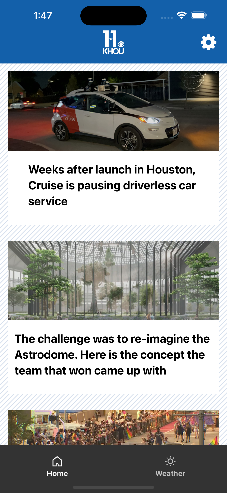
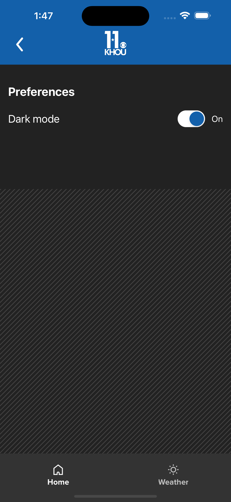

My weekend exploration creating a sample React Native app for KHOU11 news.

Features:

- News feed populated by AWS backend
- News article data stored in AWS DynamoDB database table
- Backend API developed using AWS Lambda NodeJS pulls data from AWS DynamoDB table
- In-app image caching
- Article video playback on story page
- Linking to website article
- Google Admob ads integration into news feed and Story page
- Initial setup for GA4 analytics integration
- Custom Tab bar
- Redux state management
- Light and dark mode

